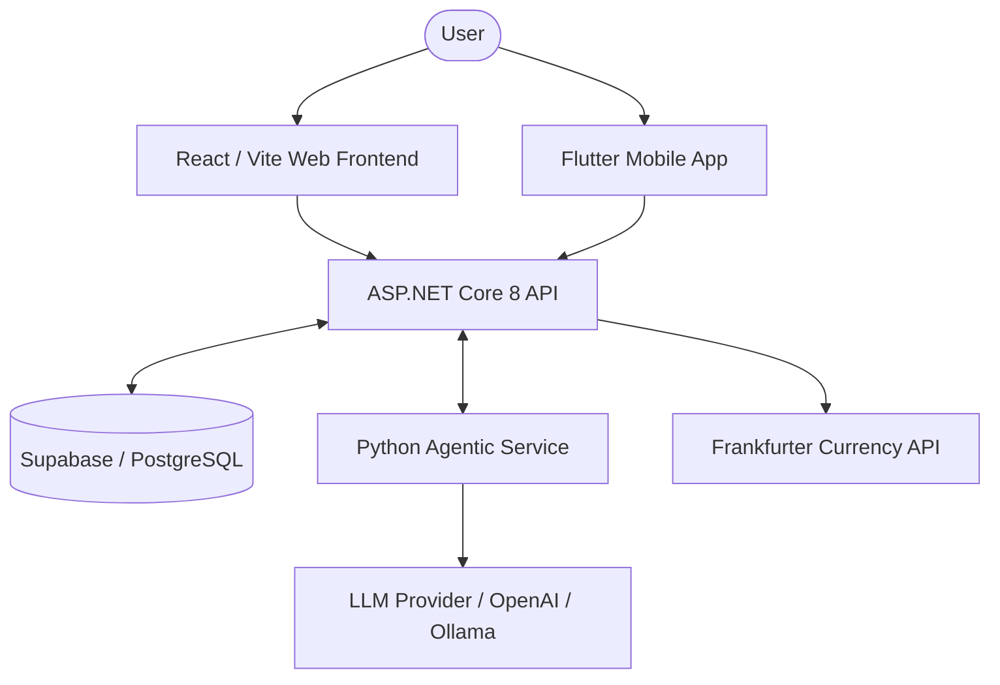

# AI House Planner

> An AI-assisted residential house planning and architectural workflow system combining agentic AI, deterministic geometric generation, construction cost estimation, and role-based project workflows.

[Live Demo](https://ai-house-planner-akvm.vercel.app/)

*(Note: The system consists of multiple deployed services. Ensure all backend APIs are active for full functionality.)*

## Table of Contents
- [Overview](#overview)
- [Key Features](#key-features)
- [System Architecture](#system-architecture)
- [AI and Deterministic Architecture](#ai-and-deterministic-architecture)
- [Agentic Workflow](#agentic-workflow)
- [House Design Generation](#house-design-generation)
- [Construction Cost Estimation](#construction-cost-estimation)
- [User Roles](#user-roles)
- [Technology Stack](#technology-stack)
- [Project Structure](#project-structure)
- [Getting Started](#getting-started)
- [Environment Variables](#environment-variables)
- [Running the System](#running-the-system)
- [API Overview](#api-overview)
- [Testing](#testing)
- [CI/CD](#cicd)
- [Deployment](#deployment)
- [Security](#security)
- [Reliability and Error Handling](#reliability-and-error-handling)
- [Screenshots](#screenshots)
- [Contributors](#contributors)
- [Future Improvements](#future-improvements)
- [Limitations](#limitations)
- [License](#license)
- [Project Status](#project-status)

## Overview

AI House Planner is a sophisticated full-stack platform designed to simplify the complex architectural drafting and cost-planning process. 

The core problem it solves is bridging the gap between a homeowner's raw spatial constraints (e.g., land size, terrain, budget) and actionable, professional architectural layouts. The system is designed for homeowners, architects, and construction contractors, providing a unified workspace for submitting requirements, visualizing AI-generated floor plans, and validating construction feasibility.

By employing an **agentic architecture**, the system can reason through subjective architectural preferences (e.g., open-concept layouts). Simultaneously, it strictly relies on **deterministic software** for critical geometric constraints and cost mathematics, ensuring the final output is structurally sound and financially accurate.

## Key Features

- **Land & House Requirement Intake:** Customers can submit terrain types, land dimensions, and room preferences.
- **AI-Assisted Planning & Orchestration:** An intelligent workflow dynamically coordinates multi-agent reasoning.
- **Automated House Design Generation:** Produces logical room placements and dimensions based on constraints.
- **Multi-Floor Layouts & Terrain Handling:** Accommodates vertical alignment, stair cores, and sloping terrain.
- **Deterministic Geometry Validation:** Ensures generated plans conform to real-world geometric constraints.
- **Construction Cost Estimation:** Calculates exact material and labour costs derived from applied area and terrain multipliers.
- **LKR to USD Currency Conversion:** Real-time conversion toggle seamlessly integrated into the frontend.
- **Workflow Persistence & Versioning:** Tracks active design iterations and saves approved revisions.
- **Role-Based Access:** Distinct capabilities for Customers, Architects, and Constructors.
- **Interactive 3D/Visual Presentation:** Renders generated layouts directly in the browser.

## System Architecture

The ecosystem relies on an event-driven sequence between distinct, isolated layers.

### Frontend
A Single Page Application built with **React, TypeScript, and Vite**, utilizing Redux Toolkit for state management, Tailwind CSS for styling, and `three.js` (React-Three-Fiber) for spatial visualization.

### ASP.NET Core Backend
The central `.NET 8` API acts as the deterministic gatekeeper. It handles CRUD operations, verifies Supabase JWT authentication, persists JSON plans, estimates costs via business logic templates, and securely proxies external APIs.

### Python Agentic Service
A highly specialized **FastAPI (Python 3.11)** service powered by LangChain. It executes non-deterministic reasoning, AI validations, and orchestration. Once a workflow finishes, it securely pushes the generated geometry back to the ASP.NET API via internal authenticated endpoints.

### Database
A **PostgreSQL** database managed by **Supabase**, storing user credentials, workflow states, design revisions, and cost data.

### AI/LLM Layer
Powered by **OpenAI** (e.g., `gpt-4o`), with robust fallback integration for local **Ollama** models.

### External Services
Leverages the free **Frankfurter API** exclusively for live LKR-to-USD exchange rate calculations.



## AI and Deterministic Architecture

To guarantee reliability, reproducibility, and safety, the architecture enforces a strict separation between AI reasoning and deterministic logic. The system does not rely on an LLM for every calculation.

### Agentic/AI Layer
Handles subjective and heuristic tasks:
- Interpreting ambiguous user requirements and preferences.
- Orchestrating workflow steps and coordinating agent roles.
- Making high-level spatial planning decisions (e.g., room adjacency logic).

### Deterministic Software
Handles strict, rule-based computational tasks:
- **Geometry Generation:** Calculating exact room dimensions and wall coordinates.
- **Geometric Constraints:** Enforcing multi-floor vertical alignment and stair core placement.
- **Cost Calculations:** Multiplying exact square footage by terrain and material templates.
- **Database Persistence & API Validation:** Securing data integrity and enforcing authorization.

## Agentic Workflow

The execution sequence coordinates seamlessly between the user, the ASP.NET backend, and the Python service:

1. **User Request:** The customer submits land dimensions and preferences via the frontend.
2. **Workflow Initiation:** The ASP.NET backend creates a database record and triggers the workflow.
3. **Agentic Orchestration:** The Python Agentic Service receives the payload and initializes a coordinator agent.
4. **Step Execution:** Individual AI agents evaluate constraints, feasibility, and design topologies.
5. **Deterministic Processing:** Python-side deterministic tools validate the AI's proposed geometries.
6. **Persistence:** The Agentic Service successfully pushes the validated floor plan geometry back to the ASP.NET API using an internal webhook.
7. **Frontend Update:** The ASP.NET API exposes the updated `COMPLETED` state to the frontend, which renders the interactive 2D/3D design.

## House Design Generation

House layouts are not merely text outputs. The Python service constructs structured geometric models representing:
- **Floor Layouts:** Support for single and multi-floor configurations.
- **Vertical Alignment:** Enforced alignment for stair cores across multiple levels.
- **Room Dimensions & Placement:** Validated boundaries mapped onto a coordinate grid.
- **Terrain Constraints:** Automated foundation adjustments based on terrain slopes (e.g., flat, sloping).

The AI's spatial adjacency proposals are passed through a deterministic layout solver before being committed to the database.

## Construction Cost Estimation

Cost modeling is fully deterministic and occurs entirely on the backend to prevent tampering.

- **Calculation Basis:** Costs are derived by combining the *applied area (sq ft)*, *terrain multipliers*, and pre-defined *material/labour templates*.
- **Cost Heads:** Calculates distinct line items (e.g., Foundation, Masonry, Roofing) and aggregates them into a Total Construction Cost.
- **Base Currency:** All calculations, database persistence, and internal models operate strictly in **LKR** (Sri Lankan Rupees).

### USD Currency Conversion
To accommodate international stakeholders, the frontend provides an interactive LKR-to-USD toggle.
- **Frankfurter API Integration:** The frontend requests exchange rates from a dedicated ASP.NET endpoint, which securely proxies the request to the Frankfurter API.
- **Fail-Safe Design:** The external API key is never exposed to the frontend. If the Frankfurter API goes offline, the ASP.NET backend handles the failure gracefully, and the frontend simply disables the USD toggle while leaving the core LKR system 100% operational.

## User Roles

The system enforces strict role-based access control (RBAC):

| Role | Responsibility |
|---|---|
| Customer | Submits terrain requirements, generates designs, and views cost breakdowns. |
| Architect | Reviews generated designs, validates spatial logic, and oversees architectural integrity. |
| Constructor | Manages construction readiness, cost templates, and workflow transitions. |

*(Note: Currently, the ASP.NET API maps the Architect role to emails containing "architect", while others default to Constructor/Customer. Future iterations will support persistent database roles).*

## Technology Stack

| Layer | Technology | Purpose |
|---|---|---|
| Frontend | React, Vite, TypeScript, Tailwind CSS, Three.js | SPA UI, state management, and 3D floor plan visualization |
| Backend | ASP.NET Core 8, C# | Primary REST API, authentication, database persistence |
| Agentic Service | Python 3.11, FastAPI, LangChain, Tenacity | Agentic workflow orchestration, AI reasoning, geometry generation |
| Database | PostgreSQL (Supabase) | Relational data persistence, authentication |
| AI/LLM | OpenAI (gpt-4o), Ollama | Large Language Models for spatial reasoning |
| Testing | Vitest, xUnit, Pytest | Comprehensive unit and integration testing |
| CI/CD | GitHub Actions | Automated build, lint, and cross-service test pipelines |
| Deployment | Vercel, Render | Frontend hosting (Vercel) and Backend/Python hosting (Render) |

## Project Structure

```text
ai-house-planner/
├── .github/workflows/        # Automated CI/CD pipelines
├── HousePlanner-Web/         # React SPA frontend (Vite, Tailwind, Three.js)
├── HousePlanner.API/         # ASP.NET Core 8 REST API
├── HousePlanner.API.Tests/   # xUnit testing suite for the API
├── agentic-service/          # Python AI workflow orchestration (FastAPI)
├── mobile/                   # Flutter mobile application
├── docs/                     # Project documentation
└── README.md                 # This file
```

## Getting Started

### Prerequisites
- [Git](https://git-scm.com/)
- [Node.js](https://nodejs.org/) (v20 or higher)
- [.NET 8 SDK](https://dotnet.microsoft.com/download)
- [Python 3.11+](https://www.python.org/downloads/)
- Supabase Project (Email/Password Auth enabled)

### Clone the Repository
```bash
git clone https://github.com/devFelina/ai-house-planner.git
cd ai-house-planner
```

### Frontend Setup
```bash
cd HousePlanner-Web
cp .env.example .env
npm install
```

### ASP.NET API Setup
```bash
cd HousePlanner.API
cp .env.example .env
dotnet restore
dotnet dev-certs https --trust
```

### Agentic Service Setup
```bash
cd agentic-service
python -m venv .venv
source .venv/bin/activate  # On Windows: .venv\Scripts\activate
pip install -r requirements.txt
cp .env.example .env
```

## Environment Variables

Configure your local environments using the `.env.example` templates. **Never commit real secrets.**

**HousePlanner-Web (`.env`)**
```ini
VITE_SUPABASE_URL=<your-supabase-url>
VITE_SUPABASE_ANON_KEY=<your-supabase-anon-key>
VITE_API_BASE_URL=https://localhost:7193/api/v1
```

**HousePlanner.API (`.env`)**
```ini
SUPABASE_URL=<your-supabase-url>
SUPABASE_SERVICE_ROLE_KEY=<your-service-role-key>
AGENTIC_INTERNAL_API_KEY=<your-secure-internal-secret>
CURRENCY_API_BASE_URL=https://api.frankfurter.dev
```

**agentic-service (`.env`)**
```ini
OPENAI_API_KEY=<your-openai-api-key>
INTERNAL_API_KEY=<your-secure-internal-secret>
ASPNET_API_URL=https://localhost:7193/api/v1
```
*(Ensure `INTERNAL_API_KEY` exactly matches `AGENTIC_INTERNAL_API_KEY`)*

## Running the System

To run the system locally, you must start the services in separate terminals.

**Terminal 1: ASP.NET API**
```bash
cd HousePlanner.API
dotnet run
```
*(Runs on `https://localhost:7193` with Swagger at `/swagger`)*

**Terminal 2: Python Agentic Service**
```bash
cd agentic-service
source .venv/bin/activate
uvicorn app.main:app --host 0.0.0.0 --port 8001 --reload
```
*(Runs on `http://localhost:8001`)*

**Terminal 3: React Frontend**
```bash
cd HousePlanner-Web
npm run dev
```
*(Runs on `http://localhost:5173`)*

## API Overview

The ASP.NET Core backend exposes several strictly structured endpoint groups:

- **Authentication / Roles:** Supabase JWT validation.
- **Workflows:** Endpoints to initiate, track, and approve AI generation tasks.
- **Cost Estimation:** Endpoints to retrieve dynamic templates and calculated line items.
- **Currency:** `GET /api/v1/currency/rate?from=LKR&to=USD` (Proxies Frankfurter API).
- **Internal Webhooks:** `PATCH /api/v1/internal/workflows/{id}/plan` (Secured via internal API key for the Python service to persist generated designs).

## Testing

The project is backed by a robust suite of automated tests.

### Frontend
Executes the Vitest suite (100+ tests) covering UI components and currency conversion logic:
```bash
cd HousePlanner-Web
npm run test -- --run
```

### ASP.NET API
Executes xUnit test suites covering configuration, controllers, and services:
```bash
cd HousePlanner.API.Tests
dotnet test
```

### Agentic Service
Executes the Pytest suite (300+ tests) encompassing workflow orchestration, URL normalization, and mock API tests:
```bash
cd agentic-service
PYTHONPATH=. .venv/bin/pytest
```

## CI/CD

The repository implements automated Continuous Integration via **GitHub Actions**. Upon every push or pull request to the `main` or `Dev` branches, the following parallel jobs run:
- **Build Web Frontend:** Executes `npm run lint`, `npm test`, and `npm run build`.
- **Build and Test ASP.NET API:** Restores dependencies, builds the backend, spins up a temporary PostgreSQL service, and runs the xUnit suites.
- **Test Agentic Service:** Sets up Python 3.11, spins up a PostgreSQL service, and runs all `pytest` suites.
- **Build and Test Mobile App:** Analyzes and tests the Flutter mobile application.

## Deployment

The production architecture is heavily decentralized:
- **Frontend:** Hosted on **Vercel** (`https://ai-house-planner-akvm.vercel.app/`).
- **ASP.NET Core API:** Hosted on **Render** (via Docker).
- **Python Agentic Service:** Hosted on **Render** (via Docker).

Services communicate securely over HTTPS, and Render services are kept awake via an automated GitHub Actions ping cron job (`*/14 * * * *`).

## Security

Security is deeply integrated across all layers:
- **Authentication:** Managed externally via Supabase JWTs.
- **Authorization:** Handled server-side through C# role-based policies.
- **Inter-Service Security:** The Python agentic service authenticates with the ASP.NET API using a secret `X-Internal-API-Key` to prevent unauthorized geometry persistence.
- **Environment Isolation:** Secrets and API keys are strictly excluded from source control (via `.gitignore`).

## Reliability and Error Handling

- **Tenacity Retries:** The Python service utilizes the `tenacity` library to automatically retry failed API persistence requests.
- **Defensive Configuration:** URL variables are aggressively stripped of hidden whitespaces/newlines to prevent runtime orchestration crashes.
- **Graceful Degradation:** External dependency failures (e.g., Currency APIs) are caught and handled by disabling localized features (USD toggle) without crashing the primary business flow.

## Screenshots

*(Placeholder for future application screenshots: Landing Page, 3D Floor Plan Viewer, Cost Breakdown Dashboard, and Architect Approval Workflows.)*

## Contributors

| Student ID | Contributor |
|---|---|
| IT24100111 | Somawantha M.H.K.C |
| IT24101021 | Fernando U.D.U. |
| IT24101408 | Gunawardana D W |
| IT24101458 | Sanvidu M.G.M. |

This project was developed collaboratively as a university software engineering/AI project.

## Future Improvements

- Implementation of persistent database-backed role mapping instead of email-based heuristics.
- Expansion of the LLM fallback orchestration to include additional dynamic model providers.
- Expanded 3D rendering capabilities with dynamic material mapping.

## Limitations

- The Python Agentic Service currently relies entirely on memory/stateless task execution; long-running processes that drop connections may require full workflow restarts.
- The default cost templates are optimized for specific regional metrics and may not accurately reflect international baseline material costs without database adjustments.

## License

No license has currently been specified for this repository.

## Project Status

This is an active university project with functional, deployed components across Vercel and Render environments.
